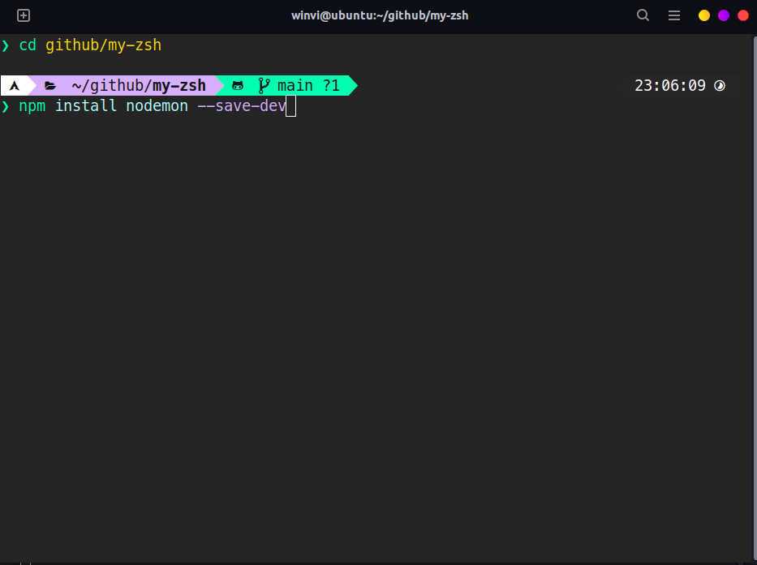

# My Zsh

### How it looks


<br>

### Install ZSH and Oh My Zsh

1. Update and Install

    ```bash
    sudo apt update && sudo apt install zsh
    ```

2. Make zsh our main shell

    ```bash
    chsh winvi -s /bin/zsh
    ```

<br>

### Install Oh My Zsh

1. Install Curl

    ```bash
    sudo apt install git curl -y 
    ```

2. Install OhMyZsh

    ```bash
    sh -c "$(curl -fsSL https://raw.github.com/ohmyzsh/ohmyzsh/master/tools/install.sh)"
    ```

<br>

### Install Powerlevel10k

1. Download & Set Powerlevel10k Theme:

    ```bash
    git clone [https://github.com/romkatv/powerlevel10k.git](https://github.com/romkatv/powerlevel10k.git)
    $ZSH_CUSTOM/themes/powerlevel10k
    ZSH_THEME="powerlevel10k/powerlevel10k"
    ```
<br>

### Install Font

1. Download MesloLGS NF Font

   [MesloLGS](https://github.com/romkatv/dotfiles-public/blob/master/.local/share/fonts/NerdFonts/MesloLGS%20NF%20Regular.ttf)

2. Install Font

3. Set Font on your Terminal

<br>

### My Configuration ZSH

1. My zsh repo

   [GitHub - alexxispn/my-zsh: this is my config for zsh](https://github.com/alexxispn/my-zsh)

2. Clone the repo

   ```bash
   git clone https://github.com/alexxispn/my-zsh.git
   ```

3. Copy .zshrc to your home directory

   ```bash
    cp my-zsh/.zshrc ~/
   ```

4. Copy .p10k.zsh to your home directory

   ```bash
    cp my-zsh/.p10k.zsh ~/
   ```

5. Restart your terminal

6. You should remove on your .zshrc the sections that you don't need:
 - PNPM
 - AZURE
 - BUN
 - DOCKER
 - SOME ALIASES

<br>

### Install Plugins

1. Pluggin Autosuggestion:

    ```bash
    git clone https://github.com/zsh-users/zsh-autosuggestions
    ${ZSH_CUSTOM:-~/.oh-my-zsh/custom}/plugins/zsh-autosuggestions
    ```

2. Pluggin Completions:

    ```bash
    git clone https://github.com/zsh-users/zsh-completions
    ${ZSH_CUSTOM:=~/.oh-my-zsh/custom}/plugins/zsh-completions
    ```

3. Pluggin Syntax-hihlighting:

    ```bash
    git clone https://github.com/zsh-users/zsh-syntax-highlighting.git
    ${ZSH_CUSTOM:-~/.oh-my-zsh/custom}/plugins/zsh-syntax-highlighting
    ```

4. Pluggin Z:

    ```bash
    git clone [https://github.com/agkozak/zsh-z](https://github.com/agkozak/zsh-z)
    ${ZSH_CUSTOM:-~/.oh-my-zsh/custom}/plugins/zsh-z
    ```

5. Autocomplete for Docker

   [Docker](https://www.deploycontainers.com/2021/07/19/enable-docker-cli-autocomplete-on-linux/)

<br>

If you want yo know more about my WSL or my ZSH, I highly recommend you to visit Manz's Blog, he has a lot of good
content about WSL and ZSH.

[Manz blog bout CLI & ZSH](https://terminaldelinux.com/terminal/)
